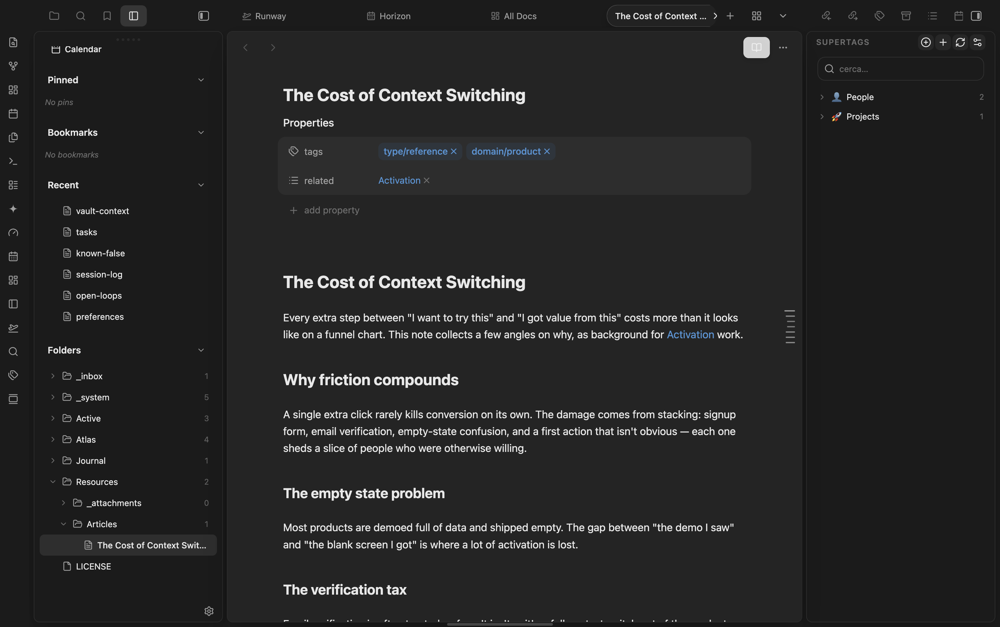

# Notion Outline

> [!WARNING]
> **Deprecated: merged into [Composer](https://github.com/mariomile/obsidian-composer).**
> The outline now ships inside Composer 0.3.0 and later, with the same look and behaviour, mobile support included.
> Install Composer, then disable Notion Outline: on first load Composer imports your Notion Outline settings.
> This repository is archived and receives no further updates.

A Notion-style outline indicator docked to the right edge of the Obsidian markdown view.

At rest it shows a vertical strip of thin ticks — one per heading — that expands on hover into a floating panel of heading titles, with the active heading tracked live as you scroll.

Part of the marioverse Obsidian plugin suite.

  

<em>The resting tick strip on the right edge, one tick per heading.</em>

## Features

- **Resting tick strip** — a vertical strip of thin horizontal ticks pinned to the right edge, one per heading. Tick length and opacity scale with heading level (h1 longest/brightest, deeper levels shorter/dimmer).
- **Hover panel** — hovering the strip expands it into a floating panel listing the heading titles, indented by level.
- **Click to scroll** — clicking a tick or a title scrolls to that heading.
- **Live active tracking** — the active heading is derived from scroll position and updates as you scroll; its tick and title are rendered in the theme accent color.
- **Editing and reading support** — works in both editing (Live Preview / Source) and reading view.
- **Theme-aware** — colors derive from theme CSS variables, so it adapts to light/dark and custom themes.
- **Heading threshold** — shown only when the note has at least `minHeadings` headings.

## Settings

| Setting | Default | Description |
|---|---|---|
| `minHeadings` | `2` | Hide the outline when a note has fewer headings than this. |
| `showInReadingView` | `true` | Also show the outline in reading mode. |

## Installation (manual / dev)

1. Clone this repository.
2. Run `pnpm install`.
3. Create a `.obsidian-plugin-dir` file in the repo root containing the absolute path to your plugin directory, e.g. `<vault>/.obsidian/plugins/notion-outline`.
4. Run `pnpm dev` for a watching build, or `pnpm build` for a one-off production build.
5. In Obsidian, open **Settings → Community plugins**, then enable **Notion Outline**.

## Development

- `pnpm dev` — esbuild watch build (rebuilds on change).
- `pnpm build` — `tsc` typecheck (`--noEmit`) followed by a production esbuild bundle.
- `pnpm test` — vitest unit tests for the pure heading/tracking logic.

### Architecture

- **Per-view DOM overlay.** Each open markdown view gets one absolutely-positioned overlay injected into its content container, parent to both the resting tick strip and the hover panel.
- **Headings from the metadata cache.** Headings come from Obsidian's metadata cache (`app.metadataCache.getFileCache(file).headings`), normalized to `{ text, level, line }` — no markdown re-parsing.
- **Pixel measurement per mode.** In editing mode, vertical positions are measured via CodeMirror 6 (`lineBlockAt(...).top`), which works even in Source mode where no `<h*>` elements exist. In reading mode, positions come from the rendered `<h1>`–`<h6>` elements' `offsetTop`. The `position-mapper` module hides this difference behind a single interface.

## Compatibility

Desktop-only. Requires Obsidian `1.4.0` or later.

## Mobile

**Unsupported** — `isDesktopOnly: true` in `manifest.json`.

## Try it

See it running in the [Obsidianverse sample vault](https://github.com/mariomile/obsidianverse-sample-vault), a small, fictional vault with the whole plugin suite pre-configured.

## License

MIT — see [LICENSE](LICENSE).
